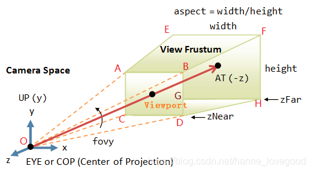

# index.html

---

## 坐标系

x、y：屏幕长、宽
z：垂直于屏幕；`调整相机和物体的距离`

## PerspectiveCamera

> PerspectiveCamera: 透视相机，远近处物体大小不同
>
> OrthographicCamera: 正投影相机，远近处大小都一样

-   near 和 far 不能相同，near 不能为负值
-   near 和 far，分别是 近剪裁平面(ABCD)和远剪裁平面(EFGH)到相机的距离 ，即图中的 OC 和 OG
-   
